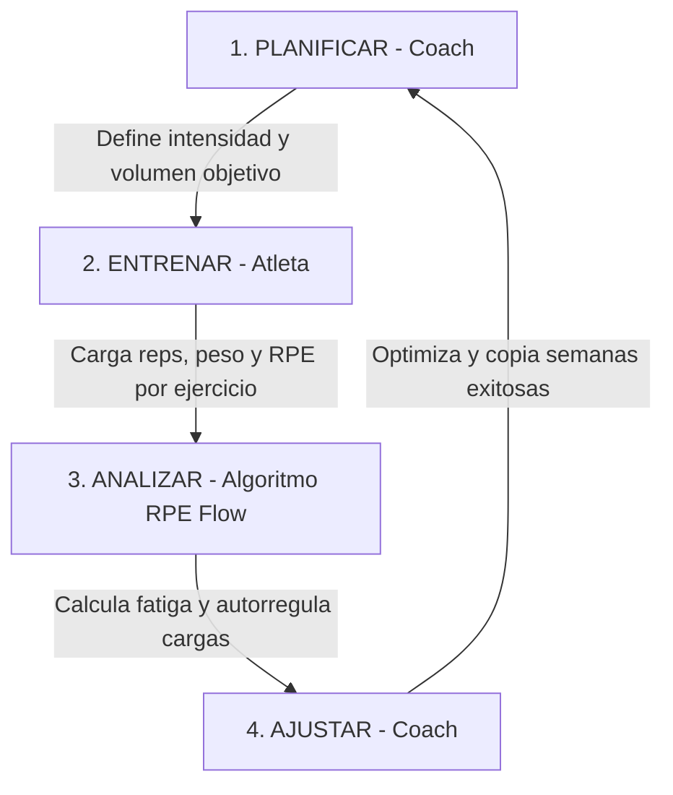

# 🏋️‍♂️ RPE Flow — Especificación del Flujo de Trabajo (Pitch & Technical Blueprint)

Este documento define el ciclo de vida de los datos y el flujo de interacción de **RPE Flow** desde dos perspectivas: una presentación conceptual de alto nivel (para inversores) y una especificación algorítmica rigurosa (para desarrollo).

---

## 📢 Parte 1: El Pitch del Flujo (Para Inversores)
*¿Cómo soluciona RPE Flow el problema del sobreentrenamiento y optimiza el rendimiento deportivo en 4 pasos simples y sin fricción?*



### Paso 1: Planificar Inteligente (El Coach prescribe)
*   **El Problema en el mercado:** Los entrenadores hoy usan planillas de Excel complejas o aplicaciones confusas que requieren registrar demasiados datos inútiles.
*   **Nuestra Solución:** El Coach accede a su panel y programa la semana del atleta en segundos. Define la frecuencia (ej: 3 días) y añade los ejercicios clave. Para cada uno prescribe: **Series**, **Repeticiones objetivo**, **Peso base** e **Intensidad relativa objetivo (RPE)**.

### Paso 2: Ejecución Sencilla (El Atleta entrena y registra)
*   **El Problema en el mercado:** Si una aplicación de entrenamiento es tediosa o requiere llenar 50 inputs durante la sesión, el atleta deja de usarla.
*   **Nuestra Solución:** El atleta entra desde su móvil y ve su rutina asignada para hoy. Al terminar cada ejercicio, registra el peso y las repeticiones reales de sus series (pre-completadas con el plan para ahorrar tiempo) y califica la dificultad general del ejercicio usando **un único slider de RPE (del 1 al 10)**.

### Paso 3: Autorregulación Instantánea (El Algoritmo procesa)
*   **El Valor Añadido:** Al segundo en que el atleta presiona "Guardar", nuestro motor compara la intensidad planificada por el coach contra el esfuerzo real percibido por el atleta:
    *   **RPE Real <= 7:** El atleta entrenó holgado. Recomendación: **Subir carga (+2.5 kg)**. Estado: 🟢 Verde.
    *   **RPE Real 8–9:** Estímulo óptimo. Recomendación: **Mantener carga**. Estado: 🟡 Amarillo.
    *   **RPE Real 10:** Esfuerzo máximo / Cerca del fallo. Recomendación: **Bajar carga / Descarga**. Estado: 🔴 Rojo.

### Paso 4: Monitoreo y Escalabilidad (El Coach optimiza)
*   **El Cierre del Círculo:** El Coach recibe una alerta de fatiga en su dashboard si el atleta está en zona roja (RPE 10). Puede ver la comparativa visual de lo planificado vs. lo realizado para reajustar cargas de las próximas sesiones o **copiar la estructura completa de la semana anterior** con un solo clic para escalar su volumen de trabajo.

---

## 💻 Parte 2: Especificación Técnica y Modelo de Datos (Para Desarrollo)
*Reglas algorítmicas estrictas para implementar un código sólido y sin parches.*

### 1. Modelo de Datos y Restricciones
*   **Unicidad Semanal (Único Plan por Atleta/Semana):**
    *   La tabla `plans` debe tener una restricción de clave única: `UNIQUE(athlete_id, week_start_date)`.
    *   `week_start_date` es estrictamente la fecha del lunes de la semana correspondiente (formato `YYYY-MM-DD`).
*   **Relación de Sesiones:**
    *   Un plan tiene $N$ sesiones (`frequency_days`).
    *   Cada sesión (`plan_sessions`) tiene una fecha específica (`date`).
    *   **Validación de Rango:** La fecha de cada sesión debe estar dentro del rango `[week_start_date, week_start_date + 6 días]`. El backend debe rechazar cualquier plan que viole esta regla.
*   **Estructura de Ejercicios por Serie:**
    *   La tabla `plan_exercises` registra datos a nivel de serie (`set_number`).
    *   **Importante (RPE por Ejercicio):** Aunque los datos se guarden a nivel de serie, el RPE real y la recomendación se aplican a nivel de **ejercicio** (todas las series de ese ejercicio en esa sesión compartirán el mismo `actual_rpe` y `recommendation`).

### 2. Ciclo de Vida del Plan (CRUD y Validaciones)

#### A. Crear o Actualizar Plan (`POST /api/plans`)
```python
# Algoritmo de validación y guardado
1. Recibir json con athlete_id, week_start_date, frequency_days, y sessions (con exercises).
2. Calcular Monday (Lunes) de week_start_date para estandarizar la fecha del plan.
3. Para cada sesión en sessions:
    a. Validar que sesión.date esté entre Monday y Monday + 6 días.
    b. Si no, abortar y retornar Error 400 (Fecha de sesión fuera de la semana planificada).
4. Buscar en la base de datos si ya existe un plan para (athlete_id, week_start_date):
    a. Si existe:
        - Si plan.status es 'completado', abortar y retornar Error 400 (Plan completado no modificable).
        - Si está 'pendiente', obtener plan_id. Borrar de forma cascada todos los plan_exercises y plan_sessions asociados a ese plan_id. Actualizar la frecuencia del plan.
    b. Si no existe:
        - Crear un nuevo registro en plans (status = 'pendiente'). Obtener el nuevo plan_id.
5. Para cada sesión en la petición:
    a. Insertar en plan_sessions (plan_id, day_number, date, status='pendiente'). Obtener session_id.
    b. Para cada ejercicio en la sesión:
        - Iterar del set_number 1 hasta sets_count:
            * Insertar en plan_exercises (session_id, exercise, set_number, planned_weight, planned_reps, planned_rpe, video_url).
6. Retornar Éxito.
```

#### B. Duplicar / Copiar Plan (`POST /api/plans/copy`)
```python
# Algoritmo de clonación
1. Recibir athlete_id, source_week_start, target_week_start.
2. Obtener el plan de origen (source_week_start). Si no existe, retornar Error 404.
3. Obtener el plan de destino (target_week_start). Si existe y su estado es 'completado', retornar Error 400.
4. Si el plan de destino existe y es 'pendiente', eliminarlo de forma cascada (usando el algoritmo A.4.a).
5. Crear el nuevo plan en target_week_start copiando la frecuencia del de origen.
6. Para cada sesión del plan de origen:
    a. Calcular la fecha destino correspondiente (target_week_start + offset de días de la sesión origen).
    b. Crear la sesión destino y copiar todos sus ejercicios (copiando series, pesos planificados, reps, RPE planificado y video).
7. Retornar Éxito.
```

#### C. Completar Sesión (`POST /api/sessions/<id>/complete`)
```python
# Algoritmo de carga de resultados y recomendación
1. Recibir json con exercises (lista de objetos con: id, actual_weight, actual_reps) y rpe_por_ejercicio (mapeo de nombre_ejercicio -> actual_rpe).
2. Para cada ejercicio cargado:
    a. Obtener el actual_rpe correspondiente de la petición.
    b. Calcular la recomendación y el estado de fatiga en base a este actual_rpe:
        - RPE <= 7: "Subir carga (+2.5 kg)" / Fatiga: "Verde"
        - RPE 8-9: "Mantener carga" / Fatiga: "Amarillo"
        - RPE 10: "Bajar carga / Descarga" / Fatiga: "Rojo"
    c. Actualizar plan_exercises con actual_weight, actual_reps, actual_rpe, recomendación y fatiga.
3. Marcar plan_sessions.status como 'completado'.
4. Verificar si todas las sesiones del plan están completadas:
    a. Si sí, marcar plans.status como 'completado'.
5. Retornar Éxito.
```

#### D. Eliminar Plan (`DELETE /api/plans/<id>`)
*   Se eliminan en cascada (`plan_exercises` -> `plan_sessions` -> `plans`).
*   Solo se permite si `plans.status` es `pendiente`.

---

## 📋 Parte 3: Acuerdos de Interfaz de Usuario (UI/UX)

### 1. Panel de Detalle del Atleta ([athlete.html](file:///home/sergio/Documents/src/rpe-flow/frontend/athlete.html))
*   **Estructura Semanal Contextual:**
    *   La navegación de semanas arriba muestra el rango de fechas actual de visualización.
    *   Si **no hay plan** para esa semana: Se muestra un banner grande, limpio e intuitivo con dos opciones:
        1. Botón **"Crear Planificación"** (abre el modal con la semana vacía).
        2. Botón **"Copiar de la semana anterior"** (aparece solo si hay un plan en la semana anterior. Al hacer clic, clona la planificación al instante).
    *   Si **hay un plan pendiente**:
        *   Muestra las tarjetas de los días planificados con sus ejercicios y series planificadas.
        *   Muestra un menú de acciones rápidas: **"Editar Planificación"** (abre el modal pre-cargado) y **"Eliminar Planificación"**.
    *   Si **hay un plan completado**:
        *   Muestra las tarjetas con la comparativa visual de lo planificado contra lo realizado.
        *   Los botones de edición/eliminación se ocultan para mantener la inmutabilidad de los datos históricos.

### 2. Modal de Planificación ([athlete.js](file:///home/sergio/Documents/src/rpe-flow/frontend/js/athlete.js))
*   **Edición Dinámica de Días:** Al cambiar la frecuencia, los tabs se ajustan inmediatamente. Al cambiar de tab, los ejercicios del día activo se guardan en memoria temporal.
*   **Edición Parcial Segura:** Si el plan ya fue iniciado (el atleta completó el Día 1), al editar el plan semanal, los campos correspondientes a las sesiones completadas se renderizarán en **solo lectura** (no se pueden modificar ejercicios ni metas de lo que ya se realizó), mientras que las sesiones pendientes se pueden editar libremente.

### 3. Registro de Entrenamiento del Atleta ([athlete-dashboard.html](file:///home/sergio/Documents/src/rpe-flow/frontend/athlete-dashboard.html))
*   **Carga Práctica de RPE:**
    *   El formulario de registro mostrará **una fila por serie** para cargar peso y repeticiones reales (pre-completadas con las metas planificadas).
    *   Al final de cada tarjeta de ejercicio, habrá **un único slider de RPE** que aplica a todo el ejercicio completo.
    *   Al lado del slider, una leyenda interactiva cambiará en tiempo real:
        *   *RPE 1-7:* "Esfuerzo moderado (puedo subir carga)"
        *   *RPE 8-9:* "Esfuerzo ideal (mantener carga)"
        *   *RPE 10:* "Esfuerzo máximo / fallo (bajar carga)"
